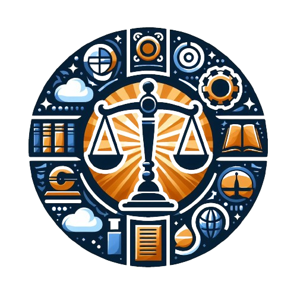
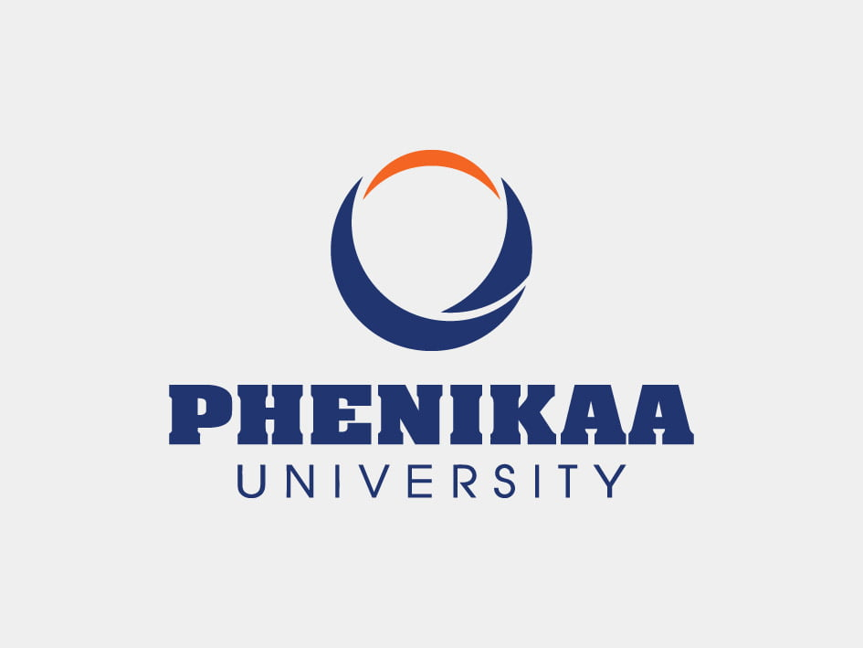
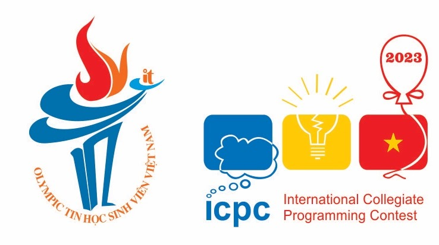
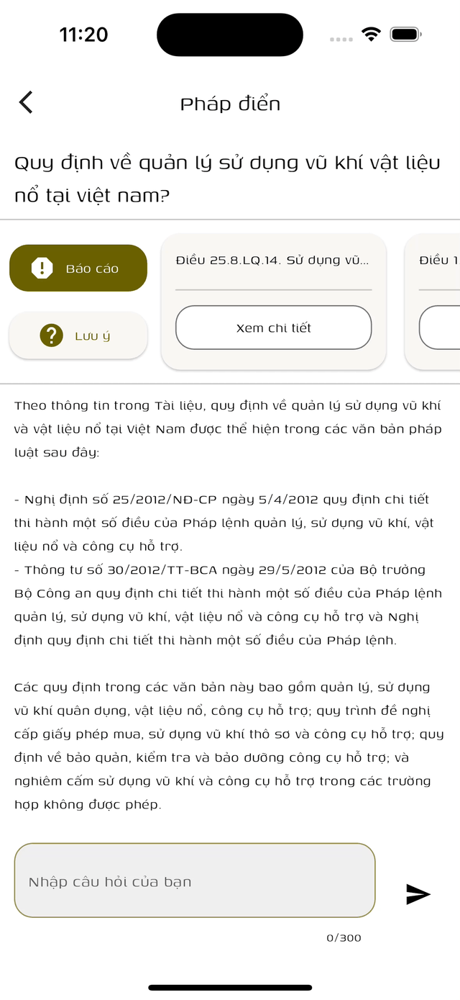

	

<h1 align="center"> Pháp điển ask </h1>

    
    
	
	

	Tra cứu pháp điển. Hỏi đáp các vấn đề liên quan đến pháp điển.

	 
	<a href="">🐞 Báo lỗi </a>
	-
	<a href="">✈️ Yêu cầu tính năng </a>
	-
	<a href="">📚 Wiki</a>
	-
	<a href="">📋 Roadmap </a>

 

<h1> Tính năng hỗ trợ </h1>

* 📖 Tra cứu pháp điển
* 📦 Backend API
* 🔍 Tìm kiếm chủ đề/đề mục/chương
* 🤖 Hỏi đáp về các nội dung liên quan
* 📱 UI di động
* 🖥️ UI Web

<h1>Mục lục</h1>

Mở rộng mục lục

- [Giới thiệu Pháp điển ask](#giới-thiệu-pháp-điển-ask)
	- [📝 Tổng quát](#-tổng-quát)
	- [🔎 Các chức năng chính](#-các-chức-năng-chính)
- [Các công nghệ sử dụng/tham khảo](#các-công-nghệ-sử-dụngtham-khảo)
- [Sử dụng](#sử-dụng)
	- [🌐 Server](#-server)
	- [📱 Ứng dụng](#-ứng-dụng)
- [CI/CD](#cicd)
- [Đóng góp](#đóng-góp)
- [Contributors](#contributors)
- [Các tổ chức hỗ trợ](#các-tổ-chức-hỗ-trợ)
- [Giấy phép](#giấy-phép)
- [Giới thiệu sản phẩm](#giới-thiệu-sản-phẩm)

# Giới thiệu Pháp điển ask

## 📝 Tổng quát

Pháp điển ask cung cấp một hệ thống Backend giúp truy cập nhanh các thông tin về pháp luật hiện hành của Việt Nam, đặt câu hỏi về các vấn đề liên quan đến pháp luật. Đồng thời cung cấp hệ thống UI điện thoại và Web cho phép người dùng tương tác với hệ thống và truy cập nhanh tới hệ thống pháp luật hiện hành của Việt Nam.

> Dự án này là sản phẩm dự thi trong cuộc thi phần mềm mã nguồn mở tổ chức bởi Câu lạc bộ Phần mềm Tự do Nguồn mở Việt Nam (Vietnam Free & Open Source Software Association - viết tắt là VFOSSA). Để tìm hiểu thêm vê thông tin cuộc thi, truy cập vào trang chủ [VFOSSA](https://vfossa.vn/tin-tuc/de-thi-phan-mem-nguon-mo-olp-2023-688.html).

## 🔎 Các chức năng chính

* Lưu trữ, tổ chức thông tin pháp luật hiện hành của Việt Nam dựa vào thông tin từ pháp điển.
* Tìm kiếm các đề mục liên quan đến một câu hỏi của nguời sử dụng.
* Trả lời một câu hỏi của người sử dụng bằng cách đưa ra các đề mục liên quan đến câu hỏi và một câu trả lời được rút trích từ nội dung các đề mục đó.
* Gợi ý các câu hỏi mà người dùng có thể sẽ muốn hỏi.

# Các công nghệ sử dụng/tham khảo

* [Dart](https://dart.dev/): Ngôn ngữ lập trình đa nền tảng.
  * [shelf](https://pub.dev/documentation/shelf/latest/): Web server framework cho Dart.
  * [chromadb](https://pub.dev/packages/chroma): Cung cấp các API để tương tác với Vector database.
  * [openai_dart](https://pub.dev/packages/openai_dart): Cung cấp các API để tương tác với LLM của OpenAI.
* [Flutter](https://flutter.dev/): SDK phát triển ứng dụng di động đa nền tảng, được phát triển bởi Google.
* [Docker](https://www.docker.com/): Nền tảng phần mềm để xây dựng, chuyển giao và chạy ứng dụng.
* [Pinecone](https://www.pinecone.io): Nền tảng AI cho các ứng dụng tìm kiếm. Cung cấp các API để xây dựng và tìm kiếm trên Vector database.
* [OpenAI](https://openai.com/): Cung cấp các API cho phép tương tác với LLM.

# Sử dụng

## 🌐 Server

Server cung cấp các API để truy cập nhanh các thông tin về pháp luật hiện hành của Việt Nam, đặt câu hỏi về các vấn đề liên quan đến pháp luật.

Các chức năng của server:
* Tải về và lưu trữ dữ liệu pháp luật hiện hành của Việt Nam.
* Embed dữ liệu pháp luật hiện hành của Việt Nam vào Vector database.
* Cung cấp RestAPI về pháp điển cho phép:
  * Lấy thông tin các chủ đề -> đề tài -> đề mục trong pháp điển.
  * Lấy nội dung một đề mục.
  * Tìm kiếm các đề mục liên quan đến một câu hỏi.
* Cung cấp RestAPI cho phép đặt câu hỏi về các vấn đề liên quan đến pháp luật:
  * Tạo ra 3 câu hỏi về các chủ đề ngẫu nhiên liên quan đến pháp luật
  * Trả lời một câu hỏi theo văn bản được chọn.
  * Đưa ra các đề mục được sử dụng để trả lời câu hỏi.
  * Đưa ra các câu hỏi mà người dùng có thể sẽ muốn hỏi.
  
Việc cài đặt và sử dụng Server chi tiết được mô tả tại [chi tiết server](./server/README.md).

## 📱 Ứng dụng

Ứng dụng cung cấp giao diện cho phép người dùng tương tác với hệ thống và truy cập nhanh tới hệ thống pháp luật hiện hành của Việt Nam.

Các chức năng của ứng dụng:
* Hiển thị các chủ đề -> đề tài -> đề mục trong pháp điển dưới dạng cây.
* Hiển thị nội dung một đề mục.
* Hiển thị giao diện tìm kiếm các đề mục liên quan đến một câu hỏi.
* Hiển thị giao diện đặt câu hỏi về các vấn đề liên quan đến pháp luật:
  * Hiển thị 3 câu hỏi về các chủ đề ngẫu nhiên liên quan đến pháp luật
  * Hiển thị các đề mục được sử dụng để trả lời câu hỏi.
  * Hiển thị các câu hỏi mà người dùng có thể sẽ muốn hỏi.
* Cho phép người dùung đặt nhiều câu hỏi về cùng một chủ đề.
* Cho phép lưu lại các câu hỏi đã đặt cùng với câu trả lời.

Việc cài đặt và sử dụng ứng dụng chi tiết được mô tả t  ại [chi tiết ứng dụng](./app/README.md).

# CI/CD

CI/CD

# Đóng góp

Hướng dẫn đóng góp vào dự án

# Contributors

<!-- ALL-CONTRIBUTORS-LIST:START -->
<!-- prettier-ignore-start -->
<!-- markdownlint-disable -->
<table>
  <tbody>
    <tr>
	  <td align="center" valign="top" width="14.28%"><a href="https://github.com/fhihung"> <b>Nguyen Phi Hung</b></a> <a href="https://github.com/definev/phapdien/commits?author=fhihung" title="Code">💻</a> <a href="https://github.com/definev/phapdien/commits?author=fhihung" title="Documentation">📖</a> <a href="#design-fhihung" title="Design">🎨</a> <a href="#promotion-fhihung" title="Promotion">📣</a></td>
      <td align="center" valign="top" width="14.28%"><a href="https://github.com/tripercy"> <b>Triperc:</b></a> <a href="https://github.com/definev/phapdien/commits?author=tripercy" title="Code">💻</a> <a href="#data-tripercy" title="Data">🔣</a> <a href="https://github.com/definev/phapdien/commits?author=tripercy" title="Documentation">📖</a> <a href="#research-tripercy" title="Research">🔬</a></td>
      <td align="center" valign="top" width="14.28%"><a href="https://github.com/definev"> <b>Duong Bui Dai</b></a> <a href="https://github.com/definev/phapdien/commits?author=definev" title="Code">💻</a> <a href="#data-definev" title="Data">🔣</a> <a href="https://github.com/definev/phapdien/commits?author=definev" title="Documentation">📖</a> <a href="#ideas-definev" title="Ideas, Planning, & Feedback">🤔</a> <a href="#projectManagement-definev" title="Project Management">📆</a></td>
    </tr>
  </tbody>
</table>

<!-- markdownlint-restore -->
<!-- prettier-ignore-end -->

<!-- ALL-CONTRIBUTORS-LIST:END -->

# Các tổ chức hỗ trợ

	
	
	
	
	

# Giấy phép

Dự án đuợc phát hành theo các quyền và điều khoản được đề cập trong giấy phép [Apache 2.0](LICENSE) license.

# Giới thiệu sản phẩm

* [Bài thuyết trình](https://www.canva.com/design/DAF2O3WpvzM/en2sc-I5Wu7Ul1QDb7ZklQ/edit?utm_content=DAF2O3WpvzM&utm_campaign=designshare&utm_medium=link2&utm_source=sharebutton)
* [Tải sản phẩm Demo](https://github.com/definev/phapdien/releases)
* Demo

	<a> Tra cứu pháp điển </a>
	 
	
	 
	<a> Tìm kiếm đề mục </a>
	 
	
	 
	<a> Chat </a>
	 
	
	 
	<a> Follow up chat </a>
	 
	
	 
	<a> Lịch sử chat </a>
	 
	

